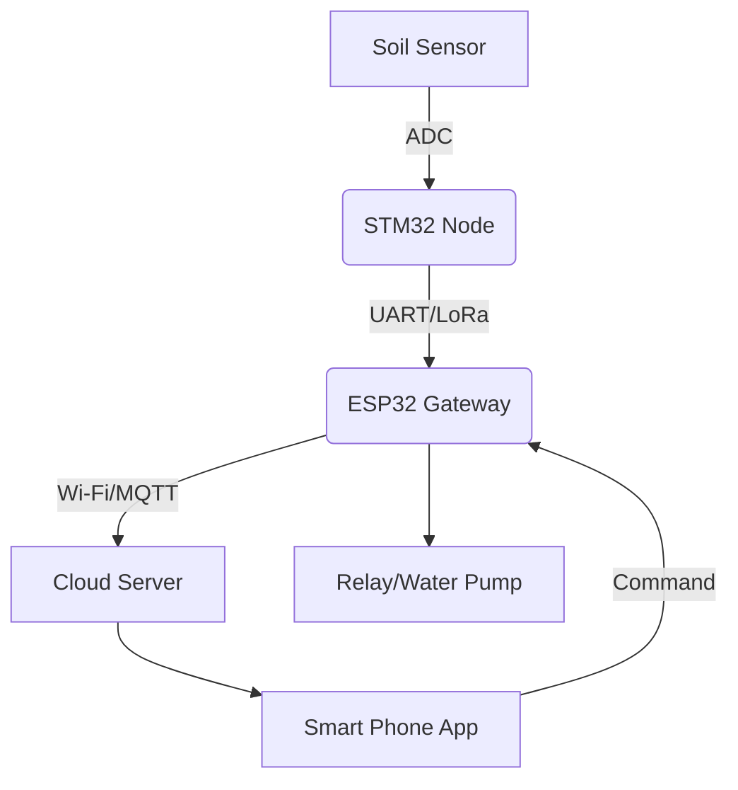

# Smart Agri-Mesh: IoT System for Sustainable Farming

## 1. Introduction
This project provides a versatile and scalable IoT solution designed to optimize irrigation and monitoring for a wide range of agricultural crops. By utilizing STM32 and ESP32, the system delivers high-precision soil moisture data at multiple depths, empowering farmers to make data-driven decisions for any farming environment, from industrial perennials to seasonal fruit trees.

## 2. System Architecture
The system follows a Star-Mesh topology:
- **Sensor Nodes (STM32F401RE):** Collect soil moisture and temperature data.
- **Gateway (ESP32):** Aggregates data from nodes and uploads it to the Cloud via MQTT.
- **Monitoring Platform:** Mobile/Web dashboard for real-time tracking and remote control.

## 3. Technology Stack
- **Hardware:** STM32F401RE (Nucleo), ESP32, Capacitive Soil Moisture Sensors.
- **Communication:** UART (Prototype), LoRa (Long-range field deployment).
- **Protocols:** MQTT, JSON.
- **Embedded Software:** C (STM32 HAL), C++ (Arduino/ESP32).

## 4. Key Features
- **High-Precision Monitoring:** Utilizes a 12-bit ADC on the STM32F401RE to accurately measure soil moisture levels.
- **Smart Connectivity:** Seamless data transmission between STM32 and ESP32 via UART/LoRa protocols.
- **Cloud Integration:** Real-time data visualization and remote control using MQTT protocol and a user-friendly dashboard.
- **Low-Power Design:** Optimized firmware to ensure long-term operation on battery power for remote farm areas.
- **Scalable Architecture:** Designed to support multiple sensor nodes for large-scale agricultural environments.
