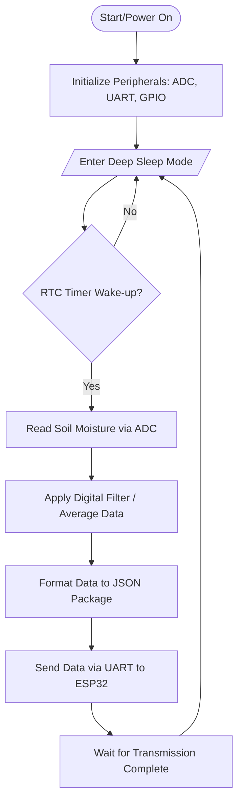

# Firmware Design & Logic

## 1. STM32 Node Flowchart
This flowchart describes the operational logic of the STM32F401RE sensor node, focusing on power efficiency for agricultural environments.

## 2. Power Management Strategy
To ensure long-term operation in remote agricultural environments, the STM32 sensor node implements a cyclic power-saving strategy:

- **Deep Sleep State:** For the majority of its operation, the MCU remains in **Deep Sleep mode**. In this state, most internal peripherals are powered off to minimize **current draw**, significantly extending battery life.
- **RTC Wake-up Mechanism:** As shown in the logic flowchart, a dedicated **RTC (Real-Time Clock) Timer** serves as a low-power alarm. It remains active while the rest of the chip is "asleep." 
- **Active Cycle:** Upon reaching the pre-defined interval, the RTC generates a **Wake-up Interrupt**, transitioning the MCU back to **Active mode**.
- **Execution & Re-entry:** Once awake, the system performs **Data Acquisition** (reading ADC) and **Transmission** (sending JSON via UART). Immediately after the task is completed, the MCU re-enters Deep Sleep to conserve energy for the next cycle.
